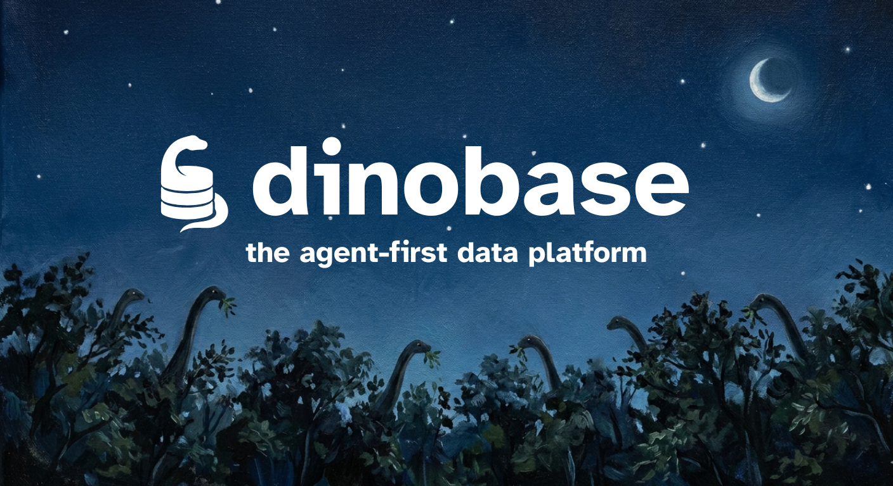

<div align="center">



# 🦕 Dinobase

<strong>The agent-native database.</strong>

Connect your business data. Let AI agents query across all of it.

[](https://pypi.org/project/dinobase)
[]()
[](LICENSE)

[Docs](https://dinobase.ai) · [Getting Started](https://dinobase.ai/getting-started/) · [Sources](https://dinobase.ai/sources/overview/)

</div>

---

Ask an AI agent: *"Which customers that churned last quarter had declining usage AND open support tickets?"*

It can't answer. The data lives across your CRM, billing, and support tools — each behind a separate API. You can't `JOIN` across REST endpoints. You can't `GROUP BY` across two SaaS tools. With Dinobase, the agent writes one SQL query and gets the answer.

## Quick start

```bash
pip install dinobase
```

### 1. Connect your data

```bash
dinobase add stripe --api-key sk_test_...
dinobase add hubspot --api-key pat-...
dinobase add linear --api-key lin_api_...
dinobase sync

# Or parquet files (no sync needed)
dinobase add parquet --path ./data/events/ --name analytics

# Or databases
dinobase add postgres --connection-string postgresql://...
```

### 2. Pick your agent interface

<table>
<tr>
<td valign="top" width="50%">

**MCP server** — for Claude Desktop, Cursor, any MCP client

```bash
dinobase serve
```

```json
{
  "mcpServers": {
    "dinobase": {
      "command": "dinobase",
      "args": ["serve"]
    }
  }
}
```

</td>
<td valign="top" width="50%">

**CLI** — for Claude Code, Aider, any agent that runs shell

```bash
dinobase info
dinobase describe stripe.customers --pretty
dinobase query "SELECT * FROM ..." --pretty
```

All commands output JSON by default.

</td>
</tr>
</table>

### 3. Ask your agent a cross-source question

> "Which companies have closed-won deals over $100K but their subscription is past due?"

The agent writes the SQL, Dinobase executes it across your sources, and the answer comes back in seconds.

## Connectors

101 sources across every category. Run `dinobase sources --pretty` to list all.

| Category | Sources |
|----------|---------|
| **CRM & Sales** | Salesforce, HubSpot, Pipedrive, Attio, Close, Copper |
| **Billing & Payments** | Stripe, Paddle, Chargebee, Recurly, Lemon Squeezy |
| **Support & Success** | Zendesk, Intercom, Freshdesk, HelpScout, Customer.io, Vitally, Gainsight |
| **Developer Tools** | GitHub, GitLab, Jira, Bitbucket, Sentry, Linear |
| **Communication** | Slack, Discord, Twilio, SendGrid, Mailchimp, Front |
| **E-commerce** | Shopify, WooCommerce, BigCommerce, Square |
| **Marketing & Analytics** | Google Analytics, Google Ads, Facebook Ads, HubSpot Marketing, Mixpanel, PostHog, Segment, Plausible, Matomo, Bing Webmaster |
| **HR & Recruiting** | Personio, BambooHR, Greenhouse, Lever, Workable, Gusto, Deel |
| **Project Management** | Asana, ClickUp, Monday, Trello, Todoist |
| **Databases** | Postgres, MySQL, MariaDB, SQL Server, Oracle, SQLite, Snowflake, BigQuery, Redshift, ClickHouse, CockroachDB, Databricks, Trino, Presto, DuckDB, MongoDB |
| **Streaming** | Kafka, Kinesis |
| **Cloud Storage** | S3, GCS, Azure Blob, SFTP |
| **Finance** | QuickBooks, Xero, Brex, Mercury |
| **Productivity** | Notion, Airtable, Google Sheets |
| **Infrastructure** | Datadog, New Relic, PagerDuty, OpsGenie, Statuspage, Cloudflare, Vercel, Netlify |
| **Content & CMS** | Strapi, Contentful, Sanity, WordPress |
| **Design** | Figma |
| **Video** | Mux |
| **Files** | Parquet, CSV (local or S3 — read at query time, no sync needed) |

## How it works

```
                    Agent (Claude, GPT, etc.)
                              |
                    +---------+---------+
                    |                   |
               MCP Server             CLI
               (tool calls)       (bash commands)
                    |                   |
                    +---------+---------+
                              |
                        Query Engine
                        (DuckDB SQL)
                              |
                 +------------+------------+
                 |            |            |
            crm.*      billing.*    analytics.*
           (synced)     (synced)    (parquet views)
```

Each source becomes a schema. Cross-source joins work via shared columns like email. Data stays in parquet — DuckDB is the query engine and metadata store.

| Source type | How it works | Data location |
|------------|-------------|---------------|
| API sources | dlt syncs to parquet | `~/.dinobase/data/` or cloud storage |
| File sources | DuckDB reads directly via views | Your storage — nothing copied |

### Cloud storage

Store data in S3, GCS, or Azure instead of local disk:

```bash
dinobase init --storage s3://my-bucket/dinobase/
```

Or via environment variable (ideal for containers):

```bash
export DINOBASE_STORAGE_URL=s3://my-bucket/dinobase/
```

Supports Amazon S3, Google Cloud Storage, Azure Blob Storage, and S3-compatible services (MinIO, R2). See [Cloud Storage Backend](https://dinobase.ai/guides/cloud-storage-backend/) for setup.

## Integrations

<table>
<tr>
<td valign="top" width="50%">

**[OpenClaw](https://dinobase.ai/guides/openclaw/)**

```bash
openclaw skills install dinobase
```

Auto-installs Dinobase and teaches your agent to query data via SQL.

</td>
<td valign="top" width="50%">

**[Vercel AI SDK](https://dinobase.ai/guides/vercel-ai/)**

```typescript
const dinobase = await createMCPClient({
  transport: new Experimental_StdioMCPTransport({
    command: 'dinobase', args: ['serve'],
  }),
});
```

Native MCP integration. Zero adapter code.

</td>
</tr>
<tr>
<td valign="top" width="50%">

**[CrewAI](https://dinobase.ai/guides/crewai/)**

```python
from integrations.crewai.tools import all_tools

agent = Agent(role="Analyst", tools=all_tools)
```

Python tools wrapping Dinobase's query engine.

</td>
<td valign="top" width="50%">

**[LangChain / LangGraph](https://dinobase.ai/guides/langchain/)**

```python
from integrations.langchain.toolkit import DinobaseToolkit

agent = create_react_agent(model, tools=DinobaseToolkit().get_tools())
```

LangChain toolkit with LangGraph agent support.

</td>
</tr>
<tr>
<td valign="top" width="50%">

**[Pydantic AI](https://dinobase.ai/guides/pydantic-ai/)**

```python
from integrations.pydantic_ai.tools import dinobase_agent, DinobaseDeps

result = dinobase_agent.run_sync(question, deps=DinobaseDeps())
```

Type-safe toolset with dependency injection.

</td>
<td valign="top" width="50%">

**[LlamaIndex](https://dinobase.ai/guides/llamaindex/)**

```python
from integrations.llamaindex.tool_spec import DinobaseToolSpec

agent = ReActAgent.from_tools(DinobaseToolSpec().to_tool_list(), llm=llm)
```

BaseToolSpec for ReAct agents.

</td>
</tr>
<tr>
<td valign="top" width="50%">

**[Mastra](https://dinobase.ai/guides/mastra/)**

```typescript
const mcp = new MCPClient({
  id: "dinobase",
  servers: { dinobase: { command: "dinobase", args: ["serve"] } },
});
const agent = new Agent({ tools: await mcp.listTools() });
```

Native MCP support. Zero adapter code.

</td>
<td valign="top" width="50%">
</td>
</tr>
</table>

## Documentation

- **[Getting Started](https://dinobase.ai/getting-started/)** — Install, connect, query in 5 minutes
- **[Connecting Sources](https://dinobase.ai/guides/connecting-sources/)** — Credentials, naming, sync intervals
- **[Querying Data](https://dinobase.ai/guides/querying/)** — Cross-source joins, aggregations, DuckDB SQL
- **[Mutations](https://dinobase.ai/guides/mutations/)** — Write data back to sources with preview/confirm flow
- **[MCP Integration](https://dinobase.ai/guides/mcp/)** — Agent setup for Claude Desktop, Cursor
- **[OpenClaw](https://dinobase.ai/integrations/openclaw/)** — OpenClaw skill setup
- **[Vercel AI SDK](https://dinobase.ai/integrations/vercel-ai/)** — MCP integration for Next.js apps
- **[CrewAI](https://dinobase.ai/integrations/crewai/)** — Python tools for CrewAI agents
- **[LangChain / LangGraph](https://dinobase.ai/integrations/langchain/)** — Toolkit with LangGraph agent support
- **[Pydantic AI](https://dinobase.ai/integrations/pydantic-ai/)** — Type-safe toolset with dependency injection
- **[LlamaIndex](https://dinobase.ai/integrations/llamaindex/)** — BaseToolSpec for ReAct agents
- **[Mastra](https://dinobase.ai/integrations/mastra/)** — Native MCP integration for TypeScript agents
- **[Syncing & Scheduling](https://dinobase.ai/guides/syncing/)** — Daemon mode, per-source intervals, concurrent sync
- **[Cloud Storage Backend](https://dinobase.ai/guides/cloud-storage-backend/)** — Store data in S3, GCS, or Azure
- **[Schema Annotations](https://dinobase.ai/guides/annotations/)** — How agents understand the data
- **[CLI Reference](https://dinobase.ai/reference/cli/)** — All commands and flags
- **[MCP Tools Reference](https://dinobase.ai/reference/mcp-tools/)** — All 7 agent tools
- **[Architecture](https://dinobase.ai/project/architecture/)** — DuckDB, dlt, MCP, module structure

## Development

```bash
git clone https://github.com/DinobaseHQ/dinobase
cd dinobase
pip install -e ".[dev]"
pytest
```

## License

MIT
