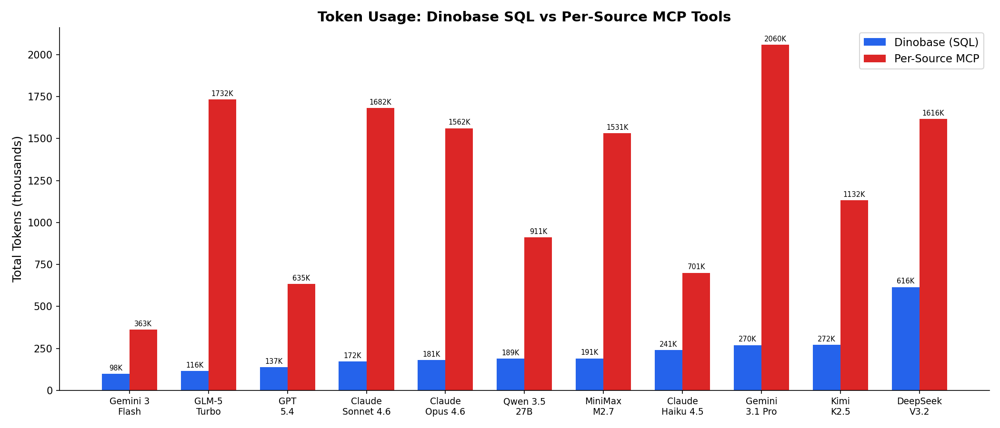

# Dinobase Benchmark Results

**11 models** tested on **15 RevOps questions** (HubSpot CRM + Stripe billing)
comparing Dinobase SQL queries vs per-source MCP tools.

## Headline Numbers

| Metric | Dinobase (SQL) | Per-Source MCP | Difference |
|--------|---------------|---------------|------------|
| **Accuracy** | **91%** (150/165) | 35% (57/165) | **+56 percentage points** |
| **Tokens per question** | 15,049 | 84,382 | **5.6x fewer** |
| **Avg latency** | 33.7s | 105.8s | **3.1x faster** |
| **Cost per correct answer** | $0.0273 | $0.4447 | **16.3x cheaper** |

*Cost per correct answer = total API cost for an approach / number of questions it answered correctly.*
*This penalizes approaches that spend tokens but get wrong answers — wasted compute.*

### The numbers that matter

1. **56 percentage points more accurate** — Dinobase SQL gets 91% right vs 35% for per-source MCP tools, across 11 different LLMs
2. **6x fewer tokens** — SQL queries return precise answers; MCP tools dump raw JSON that fills the context window
3. **3.1x faster** — 34s avg vs 106s because SQL needs fewer round trips
4. **16x cheaper per correct answer** — fewer tokens + higher accuracy + less wasted compute

## Charts

### Accuracy

### Token Usage

### Cost per Correct Answer

### Latency

## Per-Model Results

| Model | SQL Accuracy | MCP Accuracy | Gap | SQL Tokens | MCP Tokens | Token Ratio | SQL Cost | MCP Cost |
|-------|-------------|-------------|-----|-----------|-----------|------------|---------|---------|
| claude-haiku-4.5 | **93%** (14/15) | 33% (5/15) | +60pp | 241,282 | 700,674 | 2.9x | $0.29 | $0.74 |
| claude-opus-4.6 | **100%** (15/15) | 33% (5/15) | +67pp | 181,329 | 1,561,571 | 8.6x | $1.21 | $8.23 |
| claude-sonnet-4.6 | **100%** (15/15) | 53% (8/15) | +47pp | 172,278 | 1,682,310 | 9.8x | $0.69 | $5.29 |
| deepseek-v3.2 | **93%** (14/15) | 20% (3/15) | +73pp | 615,755 | 1,616,207 | 2.6x | $0.16 | $0.42 |
| gemini-3-flash | **87%** (13/15) | 33% (5/15) | +53pp | 98,007 | 362,640 | 3.7x | $0.07 | $0.20 |
| gemini-3.1-pro | **87%** (13/15) | 40% (6/15) | +47pp | 269,865 | 2,059,564 | 7.6x | $0.76 | $4.93 |
| glm-5-turbo | **93%** (14/15) | 20% (3/15) | +73pp | 115,923 | 1,732,138 | 14.9x | $0.17 | $2.47 |
| gpt-5.4 | **87%** (13/15) | 40% (6/15) | +47pp | 137,283 | 634,511 | 4.6x | $0.47 | $1.67 |
| kimi-k2.5 | **80%** (12/15) | 47% (7/15) | +33pp | 271,846 | 1,131,538 | 4.2x | $0.16 | $0.59 |
| minimax-m2.7 | **93%** (14/15) | 27% (4/15) | +67pp | 190,928 | 1,531,401 | 8.0x | $0.07 | $0.52 |
| qwen-3.5-27b | **87%** (13/15) | 33% (5/15) | +53pp | 188,601 | 910,520 | 4.8x | $0.05 | $0.28 |

## Results by Tier

**Tier 1 (Simple)**: SQL 91% vs MCP 38% (+53pp)

**Tier 2 (Semantic)**: SQL 91% vs MCP 29% (+62pp)

**Tier 3 (Cross-Source)**: SQL 91% vs MCP 36% (+55pp)

## Why Per-Source MCP Tools Fail

| Failure Category | Count | % of MCP Failures |
|-----------------|-------|-------------------|
| Wrong answer / interpretation | 67 | 62% |
| Cannot join across sources | 13 | 12% |
| Cents-to-dollars conversion (no metadata) | 10 | 9% |
| Tool use / API failure | 10 | 9% |
| Pagination (only sees 100 records) | 8 | 7% |

## Semantic Trap Analysis

| Trap | SQL Pass Rate | MCP Pass Rate | Gap |
|------|-------------|--------------|-----|
| `amounts_in_cents` | 92% (61/66) | 30% (20/66) | +62pp |
| `win_rate_formula` | 82% (9/11) | 36% (4/11) | +45pp |

## Methodology

- **Models**: 11 (claude-haiku-4.5, claude-opus-4.6, claude-sonnet-4.6, deepseek-v3.2, gemini-3-flash, gemini-3.1-pro, glm-5-turbo, gpt-5.4, kimi-k2.5, minimax-m2.7, qwen-3.5-27b)
- **Questions**: 15 RevOps questions (5 simple, 5 semantic, 5 cross-source)
- **Approaches**: Dinobase (real product — QueryEngine + OpenAPI metadata) vs per-source MCP tools (in-memory API simulation)
- **Judge**: Claude Haiku 4.5 (LLM-as-judge, different model from agents)
- **Total cost**: $29.44
- **API**: All models via OpenRouter
