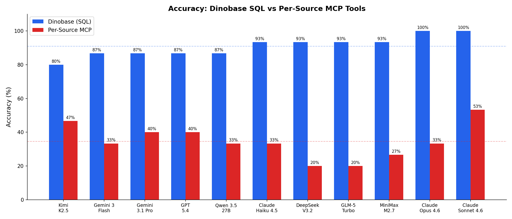
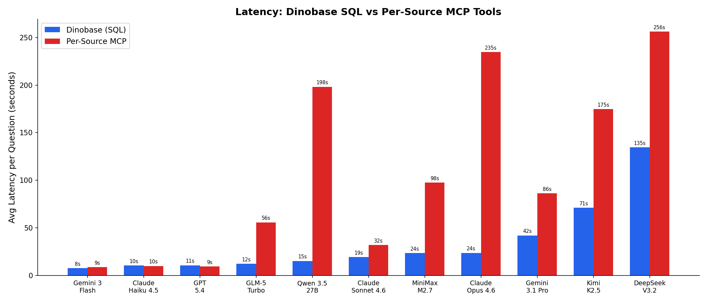
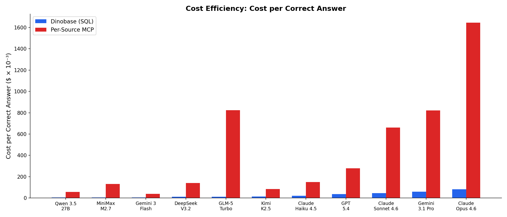

# Dinobase Benchmark Results

**11 models** · **15 RevOps questions** · HubSpot CRM + Stripe billing

## Results

| Metric | Dinobase (SQL) | Per-Source MCP | Difference |
|--------|---------------|---------------|------------|
| **Accuracy** | **91%** (150/165) | 35% (57/165) | **+56 percentage points** |
| **Avg latency per question** | 33.7s | 105.8s | **3.1x faster** |
| **Cost per correct answer** | $0.027 | $0.445 | **16x cheaper** |

*Cost per correct answer = total API cost / questions answered correctly.*

## Charts

### Accuracy

### Latency

### Cost per Correct Answer

## Per-Model Results

| Model | SQL Accuracy | MCP Accuracy | Gap | SQL Latency | MCP Latency | SQL $/Correct | MCP $/Correct |
|-------|-------------|-------------|-----|------------|------------|--------------|--------------|
| Claude Opus 4.6 | **100%** (15/15) | 33% (5/15) | +67pp | 24s | 235s | $0.081 | $1.646 |
| Claude Sonnet 4.6 | **100%** (15/15) | 53% (8/15) | +47pp | 19s | 32s | $0.046 | $0.661 |
| Claude Haiku 4.5 | **93%** (14/15) | 33% (5/15) | +60pp | 10s | 10s | $0.020 | $0.149 |
| DeepSeek V3.2 | **93%** (14/15) | 20% (3/15) | +73pp | 135s | 256s | $0.012 | $0.141 |
| GLM-5 Turbo | **93%** (14/15) | 20% (3/15) | +73pp | 12s | 56s | $0.012 | $0.824 |
| MiniMax M2.7 | **93%** (14/15) | 27% (4/15) | +67pp | 24s | 98s | $0.005 | $0.131 |
| Gemini 3 Flash | **87%** (13/15) | 33% (5/15) | +53pp | 8s | 9s | $0.005 | $0.039 |
| Gemini 3.1 Pro | **87%** (13/15) | 40% (6/15) | +47pp | 42s | 86s | $0.059 | $0.822 |
| GPT 5.4 | **87%** (13/15) | 40% (6/15) | +47pp | 11s | 9s | $0.036 | $0.278 |
| Qwen 3.5 27B | **87%** (13/15) | 33% (5/15) | +53pp | 15s | 198s | $0.004 | $0.056 |
| Kimi K2.5 | **80%** (12/15) | 47% (7/15) | +33pp | 71s | 175s | $0.013 | $0.084 |

## Results by Tier

| Tier | SQL Accuracy | MCP Accuracy | Gap |
|------|-------------|-------------|-----|
| Tier 1 — Simple (single-source) | 91% | 38% | +53pp |
| Tier 2 — Semantic (domain knowledge) | 91% | 29% | +62pp |
| Tier 3 — Cross-Source (joins required) | 91% | 36% | +55pp |

## Why Per-Source MCP Tools Fail

| Failure Category | Count | % of MCP Failures |
|-----------------|-------|-------------------|
| Wrong answer / interpretation | 67 | 62% |
| Cannot join across sources | 13 | 12% |
| Cents-to-dollars conversion (no metadata) | 10 | 9% |
| Tool use / API failure | 10 | 9% |
| Pagination (only sees 100 records) | 8 | 7% |

## Methodology

- **Models**: 11 (claude-haiku-4.5, claude-opus-4.6, claude-sonnet-4.6, deepseek-v3.2, gemini-3-flash, gemini-3.1-pro, glm-5-turbo, gpt-5.4, kimi-k2.5, minimax-m2.7, qwen-3.5-27b)
- **Questions**: 15 RevOps questions — 5 simple (single-source), 5 semantic (domain knowledge required), 5 cross-source (joins required)
- **Same for both**: same LLM, same data, same questions, max turns 15, temperature 0
- **Scoring**: deterministic for ~60% of questions (regex + tolerance checks), LLM-as-judge (Claude Haiku 4.5) for remainder
- **Total benchmark cost**: $29.44 via OpenRouter
- **Full methodology**: [README.md](../README.md)
